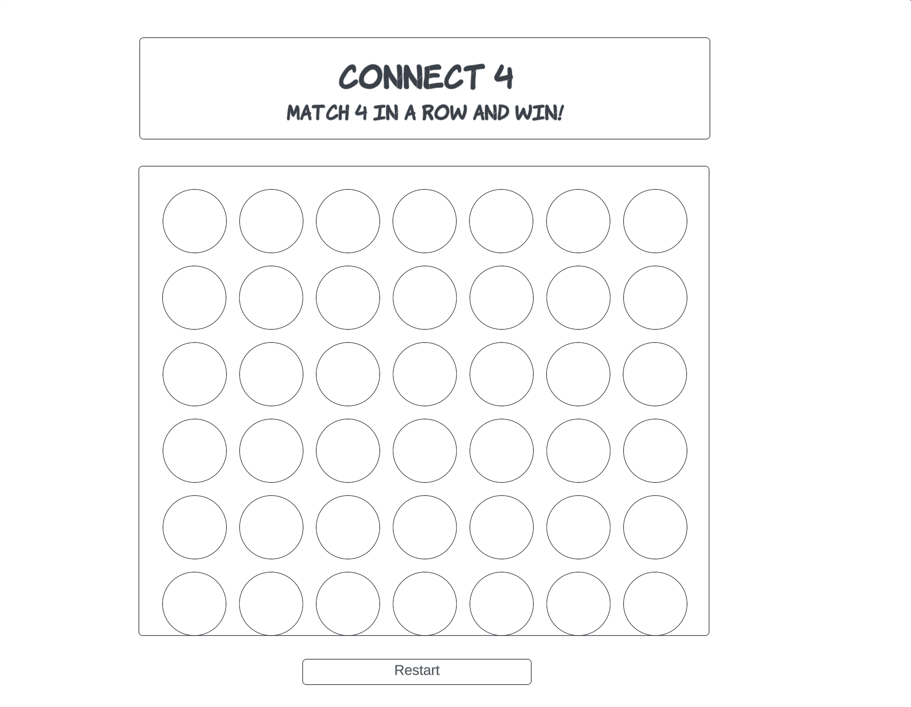

<!-- TABLE OF CONTENTS -->

  Table of Contents
  <ol>
    <li>
      <a href="#connect-4">Connect 4</a>
      <ul>
        <li><a href="#built-with">Built With</a></li>
      </ul>
    </li>
    <li>
      <a href="#approach-taken">Approach Taken</a>
    
 <li><a href="#installation-instructions">Installation Instructions</a></li>
<li><a href="#wire-frames">Wire Frames</a></li>

       

<!-- ABOUT THE PROJECT -->
# Connect 4

Connect 4 is a game that is played by two players. Players choose between yellow or red discs by choosing what player they want to be. After deciding who will go first, the player inserts a disc into a column. The discs get stacked in each column taking up the available spaces. The objective of the game is to have four matching discs in a row either horizontally, vertically or diagonally. The first player to accomplish that, wins!

### Built With

This is a game made from HTML, JS, CSS and jQuery that is similiar to Connect 4. I used Trello to keep track of the steps I had to do, was currently working on and had done. 

(<a href="#top">back to top</a>)

<!-- GETTING STARTED -->
## Approach Taken
I began by setting up HTML, CSS and Javascript files. I then rendered a page to display the board game. I introduced the idea of having two players with preassigned discs (Player 1= red, Player 2= yellow). I allowed Player 1 to start the game by clicking on a column to drop the first disc. I then allowed Player 2 to drop their disc in any column after Player 1. I allowed both players the ability to either block the other player's moves or try to create their own path to connect four in a row and win the game. I also added a "restart" button to allow players to play the game as many times as desired. 

  

## Installation

Download and play the game in your browser. It is a 2 player game. Then hit "restart" to play again!

(<a href="#top">back to top</a>)

<!-- Wire Frames -->
## Wire Frames

(<a href="#top">back to top</a>)

